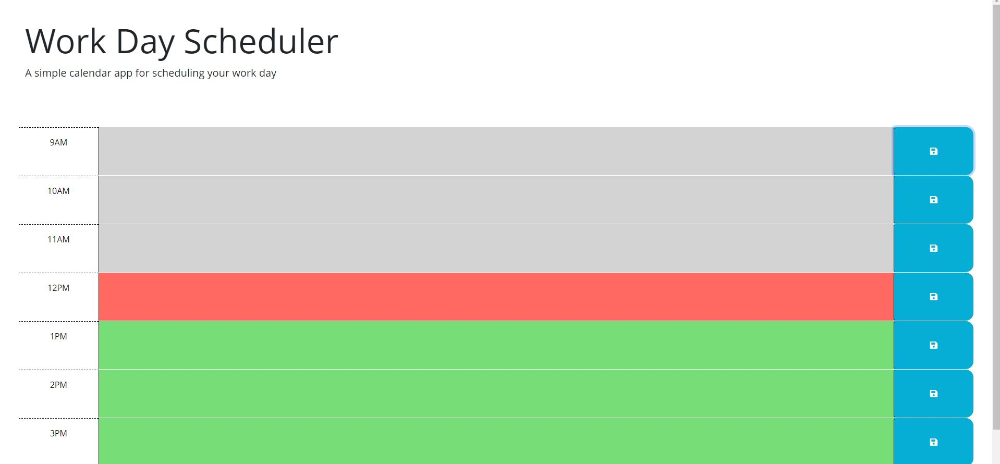
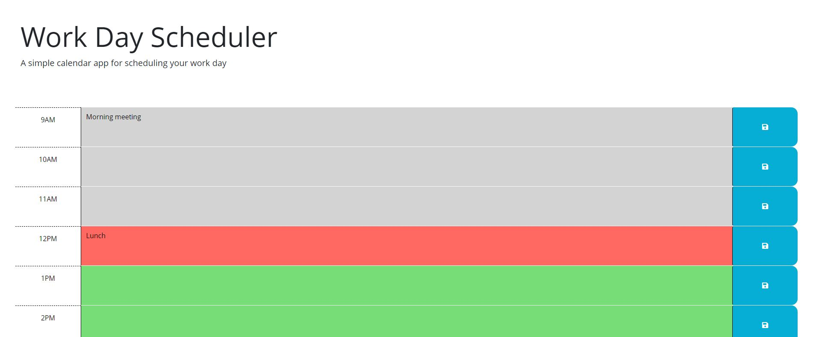

# Work Day Scheduler Starter Code
<!-- Title  -->

## Description

A workday schedular that you can make daily notes in and save the notes.

## Table of Contents

<!-- Table of Contents -->

- [About The Project](#about_project)
- [Deployment Location](#deployment_location)
- [Final Note](#final_note)

---

## About The Project 

<!-- About the Project -->

You are able to write down your daily schedule inside of this app. The app will also update the color of each hour segment signifying that if it is in the past, grey, current, red, or in the future, green. What ever notes that you make on the schedule can be saved by clicking on the save button. When you reload the page the save notes will populate. 

### Built With

<!-- Built With -->

This project is built with HTML, CSS, JavaScript, bootstrap, jQuery

### Features

<!-- Features -->

* Area to write down your schedule
* Hourly function where the colors will change in relation to the current time. 
* Notes are saved locally and then will load automatically on reload. 

## Deployment Location 

<!-- Deployment Location -->

Live link:
https://truemiguel.github.io/evening-possession-mess/

GitHub:
https://github.com/TrueMiguel/evening-possession-mess

---

## Final Note 

<!-- Final Note -->
This app will allow you to track your daily activities. Save that information so you don't lose it and also update to let you know if that note is in the past, current, or in the future. 

---